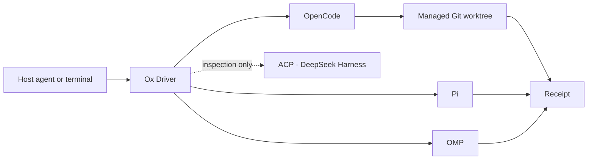
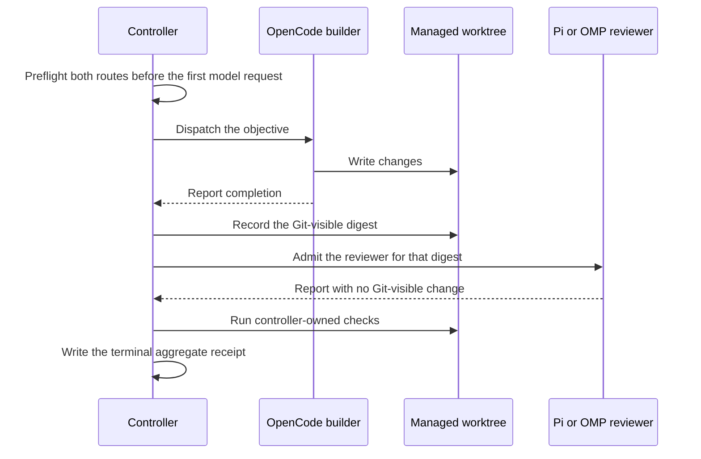

# Ox Driver

Ox Driver dispatches repository work to third-party coding agents, one worker
at a time or as a team of up to 32 lanes, and returns a durable receipt for
each one. Drive it from Claude Code, Codex, Gemini, another skill-loading host
agent, or a terminal. A receipt records the harness and route that ran, the
configured provider, model, and effort, available runtime observations, the
Git-visible paths that changed, reported cost when available, process cleanup,
and the result of every acceptance check. Ox Driver merges nothing
automatically.



## What Ox adds

Use Ox Driver when you need to verify the selected route, Git-visible changes,
acceptance results, reported cost when available, or the exact terminal
workspace a reviewer inspected.

Ox Driver applies one contract across supported harnesses. It schedules two to
32 independent or dependency-ordered lanes, preserves selected route profiles
through retries, binds a handoff reviewer or an ordered reviewer that reuses a
writer's worktree to the writer's terminal workspace digest, reconciles
Git-visible changes against declared paths, runs acceptance commands, and
stores durable per-run and aggregate receipts. It also proposes, exports, and
applies selected writer patches in a separate integration worktree. Each
harness remains independently usable. Ox Driver preserves the selected
provider, model, and reasoning effort. Each adapter enforces the tool, context,
and child policy declared for that lane.

Each OpenCode writer runs in a managed Git worktree that Ox Driver creates from
`HEAD`. Pi and OMP run in the directory you name. Create a disposable worktree
yourself before you run a Pi writer, because Ox Driver does not create one for
that harness.

## Harnesses

Ox Driver installs no harness. Install each one yourself and keep its
authentication outside Ox Driver.

- **[OpenCode](https://opencode.ai)** ([anomalyco/opencode](https://github.com/anomalyco/opencode), MIT): a terminal
  coding agent. Ox Driver reads its JSON event stream through the `opencode`
  launcher. No pinned version. Add `--expected-version` or `--expected-sha256`
  to the route profile when a task requires an exact launcher.
  Install: `curl -fsSL https://opencode.ai/install | bash`
- **[Pi](https://pi.dev)** ([earendil-works/pi](https://github.com/earendil-works/pi), MIT): a terminal coding
  agent. Ox Driver runs it through the `pi` launcher and accepts the same
  optional version and digest pins.
  Install: `curl -fsSL https://pi.dev/install.sh | sh`
- **[OMP](https://omp.sh)** ([can1357/oh-my-pi](https://github.com/can1357/oh-my-pi), MIT): a coding agent with an
  RPC interface. Ox Driver pins version `18.0.6` and the darwin-arm64 launcher
  digest `68d911038e061d35c8caa6a71c91a15b60a98f8c5464ad9f47e5d1eaeda6be4c`
  in `packages/adapters/omp/src/index.ts`. The published attested claim covers
  that exact build. Ox Driver looks for the launcher under its own harness
  directory; route profiles may select an absolute launcher instead.
  Install the qualified binary: `curl -fsSL https://omp.sh/install | sh -s -- --binary --ref v18.0.6`
- **[ACP](https://agentclientprotocol.com)** ([agentclientprotocol/agent-client-protocol](https://github.com/agentclientprotocol/agent-client-protocol),
  Apache-2.0): a JSON-RPC-over-stdio agent protocol, not a coding agent. There
  is nothing named `acp` to install; an ACP-speaking agent implements it. Ox
  Driver ships a protocol version 1 adapter that inspects an installed agent
  without a harness or model call and rejects every task dispatch.
- **[DeepSeek Harness](https://deepseek.com/harness)** ([deepseek-ai/deepseek-harness](https://github.com/deepseek-ai/deepseek-harness),
  MIT): an agent SDK, published only as pre-release builds. The adapter
  verifies an installed `0.1.1-rc.2` artifact tree and rejects every task
  dispatch.

Ox Driver runs whatever the `opencode` and `pi` names resolve to on your
`PATH`. Point `OX_DRIVER_PI_LAUNCHER` at an absolute path when you need a
specific build.

| Harness | Dispatchable work | Composition | Boundary |
| --- | --- | --- | --- |
| OpenCode | One-writer repository tasks | Solo, handoff builder, pair, team, dependencies, retry, checked integration, native direct children | Trusted host. Managed worktrees separate Git changes but provide no OS sandbox. |
| Pi | Writing or read-only review | Solo writer, solo reviewer, handoff reviewer, team, dependencies, retry, checked integration from team writers | Trusted host. You create a disposable worktree for writers. Ox does not select Pi child profiles. |
| OMP | Read-only review | Solo reviewer, handoff reviewer, mixed team, dependencies, retry | Attested. Requires a qualified macOS arm64 route. Writing and child agents are unavailable. |
| ACP | None | None | Zero-model inspection only. Preflight rejects every task dispatch. |
| DeepSeek Harness | None | None | Artifact inspection only. Preflight rejects every task dispatch. |

`doctor`, validation, tests, and dry runs make no model request. ACP and
DeepSeek Harness never receive a task prompt through Ox Driver.

## What a receipt records

Ox Driver writes one JSON receipt per run under its state root, outside the
target repository. This example is synthetic, and it is trimmed: the full
record adds start and finish timestamps, the worker's final output, captured
check output, the harness and acceptance changed-path splits, the
effective-power block, a patch reference, and notices.

```json
{
  "version": 1,
  "tier": "trusted-host",
  "runId": "example-run-0001",
  "adapterId": "opencode-v2",
  "harness": "opencode",
  "harnessVersion": "1.18.23",
  "status": "completed",
  "requestedRouteProfile": "opencode-default",
  "routeProfileSha256": "0f1e2d3c4b5a69788796a5b4c3d2e1f00f1e2d3c4b5a69788796a5b4c3d2e1f0",
  "configuredRoute": { "provider": "openrouter", "model": "z-ai/glm-5.3-flash", "reasoning": "max" },
  "costReport": { "mode": "report-only", "ceilingUsdMicros": 50000, "observedUsdMicros": 4180, "status": "within-ceiling" },
  "usage": { "providerRequests": 7, "toolCalls": 8, "childrenStarted": 0, "reportedCostUsdMicros": 4180, "complete": true, "sources": ["harness"] },
  "initialWorkspaceSha256": "1a2b3c4d5e6f708192a3b4c5d6e7f8091a2b3c4d5e6f708192a3b4c5d6e7f809",
  "postAdapterWorkspaceSha256": "2b3c4d5e6f708192a3b4c5d6e7f8091a2b3c4d5e6f708192a3b4c5d6e7f8091a",
  "finalWorkspaceSha256": "2b3c4d5e6f708192a3b4c5d6e7f8091a2b3c4d5e6f708192a3b4c5d6e7f8091a",
  "changedPaths": ["src/parse.mjs", "tests/parse.test.mjs"],
  "unownedChangedPaths": [],
  "acceptance": [
    {
      "command": "npm test",
      "passed": true,
      "exitCode": 0,
      "durationMs": 4120,
      "backgroundProcessesDetected": false,
      "processTreeReaped": true,
      "terminationEscalated": false
    }
  ],
  "eventsPath": "runs/example-run-0001/events.jsonl",
  "eventsSha256": "3c4d5e6f708192a3b4c5d6e7f8091a2b3c4d5e6f708192a3b4c5d6e7f8091a2b"
}
```

Read the three digests together. `initialWorkspaceSha256` is the worktree
before dispatch, `postAdapterWorkspaceSha256` is the worktree the harness left
behind, and `finalWorkspaceSha256` is the worktree after acceptance commands
ran. `changedPaths` lists every Git-visible change; `unownedChangedPaths` lists
the subset outside the `--owned` scope, and a non-empty value fails
reconciliation. A route that reports token counts adds `usage.tokens`.
`schemas/receipt.schema.json` is the full contract, and
[receipts and handoffs](skills/ox-driver/references/receipts-and-handoffs.md)
describes aggregate receipts, archives, and resume.

## Requirements

- Node.js 22.20 or later and npm
- Git
- An installed harness for each selected dispatch route
- Harness authentication configured outside route profiles

OpenCode writer tests run on macOS and Linux. OMP dispatch requires the
qualified macOS arm64 route. A Pi route must pass its zero-model doctor on the
machine that runs it.

## Install and build

Read the source tree before you build it: Ox Driver launches third-party
harnesses that receive your account's filesystem and network access. Then
install exact dependencies without lifecycle scripts:

```bash
npm ci --ignore-scripts
npm run build
```

Inspect the bundled skill before installing it through a host agent:

```bash
npm_config_ignore_scripts=true npx --yes skills@1.5.23 add . --list
```

The skill invokes scripts from this source tree. Keep the tree available while
using the skill.

## Command surface

The build produces two entry points, and every example below runs them with
`node`:

- `packages/cli/dist/main.js` is the controller: `doctor`, `validate`,
  `preflight`, `run`, `omp-review`, `handoff`, `inspect`, `cancel`, `recover`.
- `packages/opencode-cli/dist/main.js` is the OpenCode writer: `task`,
  `doctor`, `inspect`, `tail`, `cancel`, `recover`.

Both print usage lines that begin with `ox-driver`.
`npm exec -- ox-driver-opencode` reaches the OpenCode entry point through its
installed bin name, and the harness references use that form. Repository
scripts under `scripts/` cover routes, workspaces, pairs, dependency-aware
teams, orchestration, and integration.

## Configure routes

Each dispatch route names one launcher, provider, model, and reasoning effort.
The initializer writes route identity and optional executable checks. It never
writes authentication values.

Set three shell variables. This triple names a real provider, model, and
effort string:

```bash
provider_id="openrouter"
model_id="z-ai/glm-5.3-flash"
effort="max"
```

Ox Driver records all three strings in the route profile and passes them to the
launcher unchanged. It translates nothing, so each value must be one the
installed harness already accepts. That applies to `effort`: the route above
works on a launcher whose reasoning setting takes `max`, and another launcher
may name the same setting differently.

Create an OpenCode route:

```bash
node scripts/ox_route.mjs init-opencode \
  --launcher opencode \
  --provider "$provider_id" \
  --model "$model_id" \
  --reasoning "$effort"
node scripts/ox_route.mjs check --id opencode-default
```

Create a direct Pi route:

```bash
node scripts/ox_route.mjs init-pi \
  --launcher pi \
  --provider "$provider_id" \
  --model "$model_id" \
  --reasoning "$effort"
node scripts/ox_route.mjs check --id pi-default
```

Create an OMP route. The initializer creates the isolated agent and home
directories when they do not exist:

```bash
node scripts/ox_route.mjs init-omp \
  --launcher omp \
  --provider "$provider_id" \
  --model "$model_id" \
  --reasoning "$effort" \
  --agent-dir /absolute/path/to/omp-agent \
  --home-dir /absolute/path/to/omp-home
node scripts/ox_route.mjs check --id omp-default
```

Pass `--expected-version` or `--expected-sha256` when a route requires an exact
launcher. A custom OMP pin records exact identity; the published attested
qualification remains scoped to 18.0.6 and its documented digest. OMP accepts
repeated `--env NAME` arguments for environment-variable names admitted to its
process. The profile records names and never records their values.

Check every configured harness without making a model request:

```bash
node packages/cli/dist/main.js doctor --all
```

Read [OpenCode routes and work](skills/ox-driver/references/opencode.md),
[Pi routes and work](skills/ox-driver/references/pi.md), and
[OMP routes and review](skills/ox-driver/references/omp.md) before the first
paid dispatch.

## Run one OpenCode writer

```bash
node packages/opencode-cli/dist/main.js task /absolute/path/to/repository \
  "Implement one focused change and report the result" \
  --route opencode-default \
  --owned . \
  --check "npm test"
```

The command creates a detached managed worktree from `HEAD`, runs one writer,
then records route, usage, reported cost, process cleanup, Git-visible changes,
and acceptance results. It preserves the worktree for inspection.

Use `--no-check` only when no executable acceptance command applies. Repeat
`--owned`, `--exclude`, and `--check` to state a narrower contract.

## Run a team

An Ox team contains two to 32 lanes in any combination of OpenCode, Pi, and
OMP. Install only the harnesses named by the plan. Every lane declares its
harness, route, objective, worktree,
writer policy, dependencies, scope, checks, timeout, and reported-cost target.

Independent lanes run in parallel. A lane with `dependsOn` starts after its
dependencies complete and receives their bounded output, changed paths, run
identifiers, and terminal workspace digests. Reusing a worktree is allowed
only along an ordered dependency chain; the next lane is admitted against the
previous lane's exact terminal digest. OpenCode lanes may also use their native
direct children inside one lane.


Create a managed worktree for every independent writer or review branch. An
ordered reviewer may reuse its writer's worktree.

```bash
node scripts/ox_workspace.mjs create /absolute/path/to/repository
```

```json
{
  "version": 1,
  "lanes": [
    {
      "id": "research", "role": "researcher", "harness": "pi",
      "objective": "Inspect the design and identify the smallest safe change",
      "workerPath": "/absolute/path/to/research-worktree",
      "route": "pi-default"
    },
    {
      "id": "build", "role": "builder", "harness": "pi",
      "writerPolicy": "one-writer", "dependsOn": ["research"],
      "objective": "Implement the accepted design",
      "workerPath": "/absolute/path/to/build-worktree",
      "route": "pi-default", "ownedPaths": ["src", "tests"],
      "checks": ["npm test"]
    },
    {
      "id": "review", "role": "reviewer", "harness": "omp",
      "writerPolicy": "read-only", "dependsOn": ["build"],
      "objective": "Review the exact terminal implementation",
      "workerPath": "/absolute/path/to/build-worktree",
      "route": "omp-default", "checks": ["npm test"]
    },
    {
      "id": "synthesis", "role": "synthesizer", "harness": "pi",
      "dependsOn": ["review"],
      "objective": "Summarize the result, remaining risks, and evidence",
      "workerPath": "/absolute/path/to/synthesis-worktree",
      "route": "pi-default"
    }
  ]
}
```

```bash
node scripts/ox_team.mjs run /absolute/path/to/plan.json --concurrency 4
```

OpenCode lanes are writers and may select `agent` and `childAgents`. Pi lanes
default to read-only and may declare `writerPolicy: "one-writer"` with at least
one owned path. OMP lanes are read-only. Pi review lanes run without shell
checks; OMP review lanes may run controller-owned checks after review.

Use the same pattern with four Pi lanes when Pi is the only installed harness,
four OpenCode lanes when OpenCode is the only installed harness, or four OMP
review lanes when OMP is the only installed harness. A plan fails before
allocation when it names an unavailable capability, an unknown dependency, a
cycle, or an unordered shared worktree.

For two writers on one objective, skip the plan file:

```bash
node scripts/ox_pair.mjs "Implement two independent approaches" \
  --worker /absolute/path/to/worktree-a \
  --worker /absolute/path/to/worktree-b \
  --check "npm test"
```

Pair and team runs collect every independent lane result by default. Select
`--failure-policy fail-fast` only when the remaining lanes must stop after one
failure.

## Run a checked handoff

A handoff orders one OpenCode writer and one reviewer, and binds the reviewer
to the exact Git-visible state the writer produced.



A workspace change between the recorded digest and reviewer admission fails the
handoff, so a reviewer never reports on a tree the writer did not produce.

```bash
node packages/cli/dist/main.js handoff \
  /absolute/path/to/repository \
  "Implement one focused change" \
  --owned . \
  --builder-route opencode-default \
  --reviewer pi \
  --reviewer-route pi-default \
  --check "npm test"
```

Select `--reviewer omp --reviewer-route omp-default` for OMP. Resume an
interrupted or failed reviewer stage with the checkpoint identifier printed by
the original command:

```bash
node packages/cli/dist/main.js handoff resume HANDOFF_CHECKPOINT_ID
```

## Run Pi

Run a solo Pi writer with at least one owned path, in a worktree you created:

```bash
node scripts/ox_pi.mjs /absolute/path/to/worktree \
  "Implement one focused change and report the result" \
  --route pi-default \
  --writer \
  --owned . \
  --check "npm test"
```

Run a solo read-only Pi review:

```bash
node scripts/ox_pi.mjs /absolute/path/to/repository \
  "Review this repository for correctness risks" \
  --route pi-default
```

The writer receives the installed launcher's normal tool surface. The reviewer
receives the controller's read-only tool policy. Both preserve the selected
provider, model, effort, and configured network behavior. Put either mode in a
Pi-only or mixed team by declaring `harness: "pi"` in the lane plan.

## Run an OMP review

```bash
node packages/cli/dist/main.js omp-review \
  /absolute/path/to/repository \
  "Review this repository for correctness risks" \
  --route omp-default \
  --no-check
```

OMP review is ephemeral and read-only. The qualified route verifies the
launcher, route, isolated runtime directories, tool inventory, process
containment, and unchanged Git-visible workspace. An OMP lane can review a
dependency's exact terminal worktree inside any team plan.

## Inspect, retry, and integrate

```bash
node scripts/ox_team.mjs list
node scripts/ox_team.mjs inspect ORCHESTRATION_ID
node scripts/ox_team.mjs report ORCHESTRATION_ID
node scripts/ox_team.mjs retry ORCHESTRATION_ID --lane LANE_ID
node scripts/ox_team.mjs propose ORCHESTRATION_ID
```

`retry` re-runs one incomplete lane in its recorded worktree and preserves the
recorded route-profile digest, agent, scope, checks, timeout, and cost target.
When several failed lanes share dependencies, retry restores their order,
passes the latest completed dependency evidence forward, and rebinds a shared
worktree lane to the newest dependency digest.
`propose` reports patch sources, overlaps, conflicts, and apply order without
changing a repository. An explicit `apply` creates a separate integration
worktree and runs controller-owned checks:

```bash
node scripts/ox_integrate.mjs apply ORCHESTRATION_ID \
  --lane writer-a \
  --repo /absolute/path/to/repository \
  --check "npm test"
```

## Operating boundaries

- Trusted-host OpenCode and Pi receive the host access available to their
  installed launchers. Use repositories and worktrees appropriate for that
  access.
- Managed worktrees separate Git changes. They do not restrict filesystem or
  network access.
- `--owned` and `--exclude` classify Git-visible changes after execution. A
  change outside the admitted scope fails reconciliation.
- Trusted-host cost targets evaluate reported cost after execution. Configure
  a provider or launcher limit when a task requires a hard spending cap.
- OMP claims only the qualified read-only macOS arm64 boundary.
- Ox Driver stores objectives, absolute paths, output, events, receipts,
  patches, and managed worktrees under its configured state roots.
- Keep authentication values out of route profiles, tasks, prompts, receipts,
  repositories, and documentation.

Inspect writer diffs and receipts before you integrate any lane.

## Contributing and license

Read [Security](SECURITY.md) and [Contributing](CONTRIBUTING.md). Ox Driver is
licensed under MIT.
