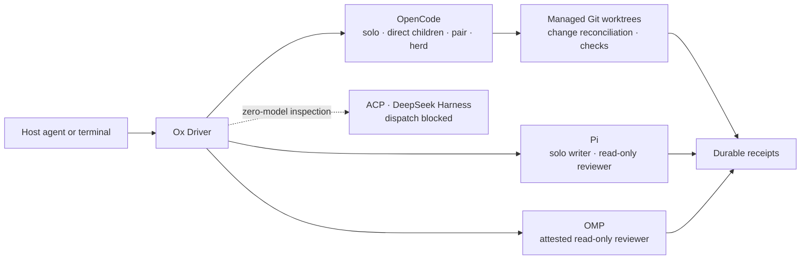

# Ox Driver

Ox Driver delegates repository writing and review to OpenCode, Pi, and OMP
from a skill-loading host agent or terminal. It preserves the selected harness
and route, can create managed Git worktrees for writers, and returns durable
receipts for output, usage, reported cost, process cleanup, changed paths, and
acceptance checks.

OpenCode handles solo writing, direct children, pairs, and herds. Pi handles solo
writing and read-only review. OMP handles attested solo read-only review on a
qualified macOS arm64 route. A handoff runs an OpenCode writer, binds a Pi or
OMP reviewer to the writer's Git-visible result, then runs controller-owned
checks.



## Harness support

| Harness | Dispatchable work | Composition | Boundary |
| --- | --- | --- | --- |
| OpenCode | One-writer repository tasks | Solo, receipt-aware direct children, pair, and herd | Trusted host. Managed worktrees separate Git changes but provide no OS sandbox. |
| Pi | Solo writing or solo read-only review | Independent herd review lane; reviewer in an OpenCode handoff | Trusted host. Requires an installed route that passes `doctor pi`. Ox-managed Pi children and teams are unavailable. |
| OMP | Solo read-only review | Reviewer in an OpenCode handoff | Attested. Requires the qualified macOS arm64 route. Writing and child agents are unavailable. |
| ACP | None | None | Zero-model inspection only. Preflight rejects every task dispatch. |
| DeepSeek Harness | None | None | Artifact inspection only. Preflight rejects every task dispatch. |

`doctor`, validation, tests, and dry runs make no model request. ACP and
DeepSeek Harness never receive a task prompt through Ox Driver.

## Requirements

- Node.js 22.20 or later and npm
- Git
- An installed harness for each selected dispatch route
- Harness authentication configured outside route profiles

OpenCode writer tests run on macOS and Linux. OMP dispatch requires the
qualified macOS arm64 route. A Pi route must pass its zero-model doctor on the
machine that runs it.

## Install and build

Review the source tree, then install exact dependencies without lifecycle
scripts:

```bash
npm ci --ignore-scripts
npm run build
```

Inspect the bundled skill before installing it through a host agent:

```bash
npm_config_ignore_scripts=true npx --yes skills@1.5.23 add . --list
```

The skill invokes scripts from this source tree. Keep the tree available while
using the skill.

## Configure routes

Each dispatch route names one launcher, provider, model, and reasoning effort.
The initializer writes route identity and optional executable checks. It never
writes authentication values.

Set values that the installed harness can reach:

```bash
provider_id="your-provider"
model_id="your-model"
reasoning_level="your-reasoning-level"
```

Create an OpenCode route:

```bash
node scripts/ox_route.mjs init-opencode \
  --launcher opencode \
  --provider "$provider_id" \
  --model "$model_id" \
  --reasoning "$reasoning_level"
node scripts/ox_route.mjs check --id opencode-default
```

Create a direct Pi route:

```bash
node scripts/ox_route.mjs init-pi \
  --launcher pi \
  --provider "$provider_id" \
  --model "$model_id" \
  --reasoning "$reasoning_level"
node scripts/ox_route.mjs check --id pi-default
```

Create an OMP route. The initializer creates the isolated agent and home
directories when they do not exist:

```bash
node scripts/ox_route.mjs init-omp \
  --launcher omp \
  --provider "$provider_id" \
  --model "$model_id" \
  --reasoning "$reasoning_level" \
  --agent-dir /absolute/path/to/omp-agent \
  --home-dir /absolute/path/to/omp-home
node scripts/ox_route.mjs check --id omp-default
```

Pass `--expected-version` or `--expected-sha256` when a route requires an exact
launcher. OMP accepts repeated `--env NAME` arguments for environment-variable
names admitted to its process. The profile records names and never records
their values.

Check every configured harness without making a model request:

```bash
node packages/cli/dist/main.js doctor --all
```

Read [OpenCode routes and work](public-docs/opencode.md),
[Pi routes and work](public-docs/pi.md), and
[OMP routes and review](public-docs/omp.md) before the first paid dispatch.

## Run an OpenCode writer

```bash
npm exec -- ox-driver-opencode task /absolute/path/to/repository \
  "Implement one focused change and report the result" \
  --route opencode-default \
  --owned . \
  --check "npm test"
```

The command creates a detached managed worktree from `HEAD`, runs one writer,
then records route, usage, reported cost, process cleanup, Git-visible changes,
and acceptance results. It preserves the worktree for inspection.

Use `--no-check` only when no executable acceptance command applies. Repeat
`--owned`, `--exclude`, and `--check` to state a narrower contract.

## Run Pi

Run a solo Pi writer with at least one owned path:

```bash
node scripts/ox_pi.mjs /absolute/path/to/repository \
  "Implement one focused change and report the result" \
  --route pi-default \
  --writer \
  --owned . \
  --check "npm test"
```

Run a solo read-only Pi review:

```bash
node scripts/ox_pi.mjs /absolute/path/to/repository \
  "Review this repository for correctness risks" \
  --route pi-default
```

Ox Driver supports Pi only in solo mode. The writer receives the installed
launcher's normal tool surface. The reviewer receives the controller's
read-only tool policy. Both preserve the selected provider, model, reasoning
effort, and configured network behavior.

## Run an OMP review

```bash
node packages/cli/dist/main.js omp-review \
  /absolute/path/to/repository \
  "Review this repository for correctness risks" \
  --route omp-default \
  --no-check
```

OMP review is ephemeral, solo, and read-only. The qualified route verifies the
launcher, route, isolated runtime directories, tool inventory, process
containment, and unchanged Git-visible workspace.

## Run a checked handoff

Use Pi to review completed OpenCode work:

```bash
node packages/cli/dist/main.js handoff \
  /absolute/path/to/repository \
  "Implement one focused change" \
  --owned . \
  --builder-route opencode-default \
  --reviewer pi \
  --reviewer-route pi-default \
  --check "npm test"
```

Select `--reviewer omp --reviewer-route omp-default` for OMP. The controller
preflights both routes, records the writer's Git-visible digest, admits the
reviewer only for that digest, then runs acceptance checks. Resume an
interrupted or failed reviewer stage with the checkpoint identifier printed by
the original command:

```bash
node packages/cli/dist/main.js handoff resume HANDOFF_CHECKPOINT_ID
```

Read [receipts and handoffs](public-docs/receipts-and-handoffs.md) for ordering,
resume, cancellation, and receipt fields.

## Run a pair or herd

Create one managed worktree for each OpenCode writer, then run independent
lanes:

```bash
node scripts/ox_workspace.mjs create /absolute/path/to/repository
node scripts/ox_workspace.mjs create /absolute/path/to/repository

node scripts/ox_pair.mjs "Implement two independent approaches" \
  --worker /absolute/path/to/worktree-a \
  --worker /absolute/path/to/worktree-b \
  --check "npm test"
```

`ox_herd.mjs` accepts two to 32 lanes and an optional concurrency bound. A lane
plan may combine OpenCode writers with an independent Pi read-only review lane.
Use handoff when the reviewer must inspect completed writer changes.

Pair and herd collect every independent lane result by default. Select
`--failure-policy fail-fast` only when the remaining lanes must stop after one
failure. Ox Driver never merges pair or herd work automatically.

## Inspect, retry, and integrate

```bash
node scripts/ox_orchestration.mjs list
node scripts/ox_orchestration.mjs inspect ORCHESTRATION_ID
node scripts/ox_orchestration.mjs report ORCHESTRATION_ID
node scripts/ox_orchestration.mjs retry ORCHESTRATION_ID --lane LANE_ID
node scripts/ox_integrate.mjs propose ORCHESTRATION_ID
```

`retry` preserves the recorded route-profile digest, agent, scope, checks,
timeout, cost target, and worktree. `propose` reports patch sources, overlaps,
conflicts, and apply order without changing a repository. An explicit `apply`
creates a separate integration worktree and runs controller-owned checks.

## Operating boundaries

- Trusted-host OpenCode and Pi receive the host access available to their
  installed launchers. Use repositories and worktrees appropriate for that
  access.
- Managed worktrees separate Git changes. They do not restrict filesystem or
  network access.
- `--owned` and `--exclude` classify Git-visible changes after execution. A
  change outside the admitted scope fails reconciliation.
- Trusted-host cost targets evaluate reported cost after execution. Configure
  a provider or launcher limit when a task requires a hard spending cap.
- OMP claims only the qualified read-only macOS arm64 boundary.
- Ox Driver stores objectives, absolute paths, output, events, receipts,
  patches, and managed worktrees under its configured state roots.
- Keep authentication values out of route profiles, tasks, prompts, receipts,
  repositories, and documentation.

Inspect writer diffs and receipts before integration. Read
[Security](SECURITY.md) and [Contributing](CONTRIBUTING.md). Licensed under MIT.
