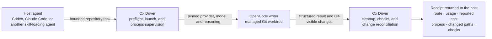
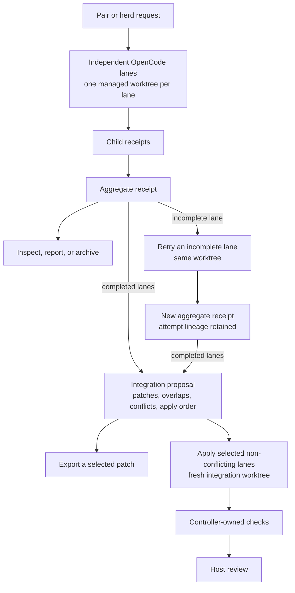

# Ox Driver 2.0 OpenCode Preview

[](https://github.com/jvogan/ox-driver/actions/workflows/validate.yml)

Ox Driver runs repository tasks through an installed OpenCode CLI in separate
managed Git worktrees. Each run produces a durable receipt containing the
configured route, reported usage and cost, process cleanup, Git-visible
changes, and acceptance-command results.

Version 2.0.0-dev.0 supports OpenCode writers on macOS and Linux. You can run
one task, compare two workers, run up to 32 independent lanes, retry incomplete
lanes, export patches, and apply selected non-conflicting patches in a separate
integration worktree. Ox Driver creates task and integration changes in
separate managed worktrees. The worker retains the host access described in
[Boundaries](#boundaries).



## Source-preview archive

This release is a deterministic source archive with a SHA-256 sidecar. No npm
package or in-place installer is provided. Verify the sidecar, extract the
archive, and enter the extracted directory:

```bash
# macOS
shasum -a 256 -c ox-driver-opencode-source-preview-2026-08-30.tar.gz.sha256
# GNU/Linux
sha256sum -c ox-driver-opencode-source-preview-2026-08-30.tar.gz.sha256

tar -xzf ox-driver-opencode-source-preview-2026-08-30.tar.gz
cd ox-driver-opencode-source-preview
```

The checksum detects corruption and binds the archive bytes to its published
digest. It cannot establish publisher identity if an archive and sidecar are
replaced together. Obtain the digest through a channel you trust.

## Quickstart

Requirements: Node.js 22.20 or later, Git, and an installed OpenCode launcher.
The launcher must already be authenticated. `npm ci` needs registry access or
matching packages in the local npm cache.

Inspect and install the bundled skill for Codex and Claude Code with:

```bash
npm_config_ignore_scripts=true npx --yes skills@1.5.23 add . --list
npm_config_ignore_scripts=true npx --yes skills@1.5.23 add . \
  --global --copy --skill ox-driver --agent codex claude-code
```

Keep the extracted release directory available. The skill runs controller
scripts from this tree.

```bash
npm ci --ignore-scripts
npm run build

node scripts/ox_route.mjs init-opencode \
  --launcher opencode --provider openrouter \
  --model z-ai/glm-5.3-flash --reasoning max
node scripts/ox_route.mjs check
npm exec -- ox-driver-opencode doctor

npm exec -- ox-driver-opencode task /absolute/path/to/repository \
  "Implement the task, verify it, and report what changed" \
  --owned . \
  --check "npm test"
```

The example requires the installed launcher to reach
`openrouter/z-ai/glm-5.3-flash` with variant `max`. Choose another provider,
model, or reasoning value when your launcher uses a different route. `check`
validates the profile file. `doctor` checks the launcher and selected profile
without making a model call. Authentication and model availability are tested
by the first task dispatch, which may incur provider cost.

The task command prints the task, worktree, and run IDs. Inspect the result and
its managed worktree with:

```bash
node scripts/ox_orchestration.mjs report TASK_ID
node scripts/ox_workspace.mjs inspect WORKTREE_ID
```

The managed worktree starts from `HEAD` unless you pass `--ref`. Uncommitted
and ignored files from the source checkout are absent. Choose an acceptance
command that works in a fresh worktree, or tell the worker to install the
required dependencies. Use `--no-check` only when the task has no executable
acceptance command.

### Preserve the selected route and worker capacity

Preserve the selected launcher, provider, model, reasoning effort, agent
profile, scope, checks, timeout, and reported-cost target. A retry uses the
recorded route-profile digest and fails if that profile changed. Create another
profile with `--id` and select it with `--route`; keep profiles referenced by
active or retryable runs unchanged.

Preserve the worker's model turns, reasoning, tools, child capacity, context,
output, and wrap-up time. Add or lower a limit only when the user requests it
or a controller policy requires it. Task, pair, and herd lanes default to 3,600
seconds. Collect every independent lane result unless the user requests
fail-fast.

## Pair, herd, retry, and integration

A pair runs two independent OpenCode lanes. A herd runs two to 32 lanes. Each
lane uses a separate managed worktree, and Ox Driver stores every child run ID
in a finalized aggregate receipt.



`apply` leaves the source working tree and refs unchanged. Read
[`skills/ox-driver/SKILL.md`](skills/ox-driver/SKILL.md) for task, pair, herd,
retry, report, archive, export, apply, cancel, and recovery commands.

## Migrating from earlier versions

Version 2.0.0-dev.0 replaces the earlier controller workflow. Read
[MIGRATION.md](MIGRATION.md) before removing any files installed
by an earlier release.

## Boundaries

OpenCode receives the filesystem and network access of the installed launcher
process. A managed worktree separates Git changes; the launcher retains access
to other host paths and credentials. Run Ox Driver only where the worker may
use the available files, credentials, and network access.

`--owned` and `--exclude` classify Git-visible changes after execution. They do
not prevent reads or writes. A change outside the permitted scope fails receipt
reconciliation.

The one-writer profile policy rejects child profiles that declare direct
write, edit, or patch tools. A shell-capable child may still change files. The
receipt reconciles the terminal Git state and does not attribute each path to a
specific agent.

`--cost-ceiling` evaluates reported cost after execution. It cannot stop
provider billing. Configure a provider-side or launcher-side limit when a run
requires a hard spending cap.

Ox Driver stores objectives, absolute paths, terminal output, events, receipts,
check results, patches, orchestration records, and managed worktrees under the
configured state roots. Use `ox_workspace.mjs list`, `inspect`, and `remove` to
manage worktrees. Other records remain until the operator removes the selected
state directory according to their retention policy.

Licensed under MIT; see
[`skills/ox-driver/LICENSE`](skills/ox-driver/LICENSE).
