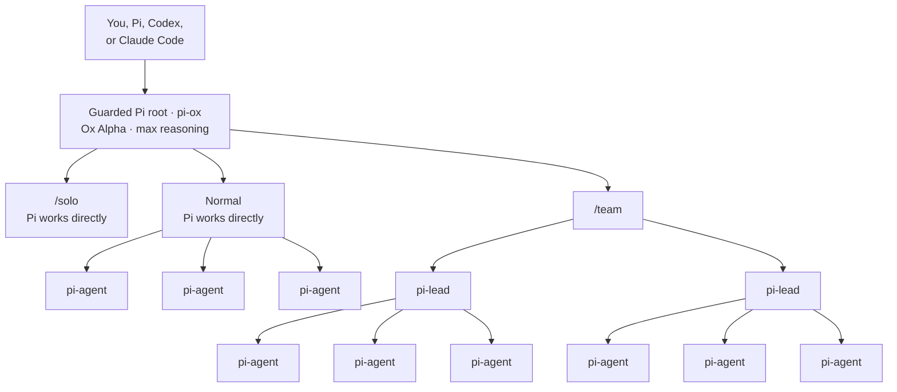

# Ox Driver

[](https://github.com/jvogan/ox-driver/actions/workflows/validate.yml)

Ox Driver uses [OpenRouter](https://openrouter.ai/stealth/ox-alpha) and the
[Pi coding agent](https://github.com/earendil-works/pi/tree/v0.84.3/packages/coding-agent)
to launch and manage a fleet of full-capability Ox Alpha agents at max reasoning.
Use the harness directly in Pi or drive it from Claude Code or Codex. Run one
agent for focused work or dispatch several in parallel across research,
implementation, review, and other independent tasks.

Ox Alpha is available through the temporary `stealth/ox-alpha` route. The Agent
Skill installs a reviewed Pi runtime, agent profiles, controller workflows, and
acceptance tests. The default `power` profile gives roots and workers normal
coding tools. Guarded launchers enforce the selected model and filesystem/network
boundaries. Raw Pi retains the user's existing default model and remains
available for ordinary work.

| Mode | Behavior |
|---|---|
| Normal | Pi works directly and may use flat `pi-agent` workers when useful. |
| Team | `/team <task>` requests `pi-lead` children with `pi-agent` leaves. |
| Solo | `/solo <task>` instructs Pi not to delegate. |



The controller owns the final result. The Pi root works directly or assigns
bounded work to agents. Team mode adds one lead layer; leaves cannot create a
third level.

Setup offers three child capability profiles:

| Capability profile | Child tools |
|---|---|
| `power` (default) | Full built-in coding tools inside the guard boundary. |
| `edit-only` | Read, search, write, and edit; the root runs commands and tests. |
| `review-only` | Read and search only; the root performs every mutation. |

The first-use flow also asks whether sandboxed bash gets open web access, a common
development allowlist, a custom domain list, or no network. The choice applies to
the guarded root and children. Model traffic is separate and continues through Pi.
`power` with `open` is the default full-capability experience. File tools remain
available across nonsensitive home and temporary paths. Guarded Bash stays
workspace-scoped and writes only in the project and temporary directory.
Credential-like files stay denied. Open shell networking can send project data to any
destination, so use a restricted option for sensitive work. Pi leaves
tool-approval policy to extensions. The guard documents
which risky Bash actions prompt in an interactive root and which violations fail
closed. The setup CLI keeps the `--permission-profile` flag name for
compatibility.

Routine reads, searches, writes, edits, commands, tests, and allowed web requests
do not prompt in `power`. Use Pi's native file tools for permitted cross-folder
work; the Bash sandbox deliberately keeps shell access narrower.

Setup makes these user-level Pi changes:

| Surface | Change |
|---|---|
| Model metadata | Adds the Ox reasoning map; does not change raw Pi's default model. |
| Runtime behavior | Sets bounded retry, large-context compaction, and disables terminal-initiated image display. |
| Fleet | Installs pi-subagents, two agent profiles, and four prompt templates when requested. |
| Protected launch | Adds inert-by-default safety extensions plus `pi-ox` and `pi-child`; the policy activates only through those launchers. |

The fixed credential denylist cannot recognize every secret or private file by
content. In `power`, native file tools may read and overwrite non-denylisted files
under the home and temporary directories without prompting, and open Bash network
can send accessible project data anywhere. Choose that profile only after reviewing
these boundaries; use a conservative profile or a non-sensitive checkout otherwise.

## Requirements

| Requirement | Purpose |
|---|---|
| macOS or Linux | The guard supports these hosts; Windows is not supported. |
| Node.js 22.20+, npm | Pi, pi-subagents, sandbox runtime, and provenance checks |
| Python 3.11+ | Setup and validation helpers |
| Bash, curl | Guarded launchers and live route checks |
| ripgrep | Sandbox deny-path detection |
| bubblewrap and socat (Linux) | Linux filesystem and network sandboxing |
| Git | Only required for worktree-based parallel writers |

The sandbox runtime is a beta research preview. Confirm that its OS prerequisites
work on the target host before sending sensitive local source to any process.

## Install the skill

From a reviewed checkout:

```bash
npm view skills@1.5.23 dist.integrity
npm_config_registry=https://registry.npmjs.org npm_config_ignore_scripts=true npx --yes skills@1.5.23 add . \
  --global --copy --skill ox-driver --agent codex claude-code
```

To avoid executing the Skills CLI, copy the reviewed `skills/ox-driver/`
directory into the agent's skills directory. Typical user-level destinations are
`${CODEX_HOME:-$HOME/.codex}/skills/ox-driver` for Codex and
`$HOME/.claude/skills/ox-driver` for Claude Code. Refuse an existing destination,
copy the whole directory, restart the client, and ask it to list or load
`ox-driver`. The installed skill contains its setup, guard, test, and provenance
helpers.

## Guided setup

Ask the coding agent that loaded this skill to set up Ox Driver. It will inspect
the existing Pi configuration, explain the three child capability profiles and
network choices, disclose the Stealth data terms, obtain the user's choices and
data-use acknowledgement, and preview every write.

Stop every active Pi root and child before setup, update, rollback, or removal.
A running process retains the extensions that it loaded at startup.

Capability and network choices have explicit previewed updaters. Core-asset
upgrade and removal are manual, review-first procedures described in
[pi-setup.md](skills/ox-driver/references/pi-setup.md).

The underlying commands for the default `power` profile with open sandboxed bash
network are:

```bash
python3 skills/ox-driver/scripts/verify_provenance.py
python3 skills/ox-driver/scripts/install_reviewed_pi.py
python3 skills/ox-driver/scripts/install_reviewed_pi.py --install
OX_REAL_PI="${XDG_DATA_HOME:-$HOME/.local/share}/ox-driver/pi/0.84.3/dist/cli.js"
"$OX_REAL_PI" --version
"$OX_REAL_PI"
# In Pi: /login openrouter

python3 skills/ox-driver/scripts/setup.py --pi-binary "$OX_REAL_PI" --dry-run
python3 skills/ox-driver/scripts/setup.py --pi-binary "$OX_REAL_PI"
python3 skills/ox-driver/scripts/setup.py --pi-binary "$OX_REAL_PI" --guard --acknowledge-stealth-terms --permission-profile power --network-profile open --dry-run
python3 skills/ox-driver/scripts/setup.py --pi-binary "$OX_REAL_PI" --guard --acknowledge-stealth-terms --permission-profile power --network-profile open

OX_PI_DIR="${PI_CODING_AGENT_DIR:-$HOME/.pi/agent}"
(cd "$OX_PI_DIR/extensions/sandbox" && npm ci --ignore-scripts)
python3 skills/ox-driver/scripts/test_guard.py --config-dir "$OX_PI_DIR"

npm_config_ignore_scripts=true "$OX_REAL_PI" install npm:pi-subagents@0.56.0
python3 skills/ox-driver/scripts/setup.py --pi-binary "$OX_REAL_PI" --fleet --permission-profile power --dry-run
python3 skills/ox-driver/scripts/setup.py --pi-binary "$OX_REAL_PI" --fleet --permission-profile power
```

Start the protected harness from a project directory:

```bash
"$OX_PI_DIR/bin/pi-ox"
```

Run `/team-smoke <question about a disposable non-sensitive fixture>` before
normal use. It is read-only and expects five to nine model calls. Run the
approval-gated `/team-acceptance
<disposable fixture and capability profile>` before allowing writing teams.

To widen or narrow a tested installation later:

```bash
python3 skills/ox-driver/scripts/setup.py --update-permission-profile --permission-profile edit-only --dry-run
python3 skills/ox-driver/scripts/setup.py --update-permission-profile --permission-profile edit-only
python3 skills/ox-driver/scripts/setup.py --update-network-profile --network-profile development --dry-run
python3 skills/ox-driver/scripts/setup.py --update-network-profile --network-profile development
```

The launcher verifies that Ox remains free and supports tools/max reasoning,
rejects system roots, the home directory, unmarked direct children of home, sensitive
directories, and model overrides; strips unrelated
environment values, disables ambient extensions, explicitly loads the reviewed
safety/sandbox/pi-subagents stack, and routes every child through `pi-child`.
It rejects Pi's project-trust override; review and trust a project interactively
before using the protected launcher there.
It also requires the setup-time Stealth-terms acknowledgement in its protected
policy file, so plain, solo, team, and externally controlled entry points share
the same first-use data gate. Review the terms again before a model migration or
after a terms change.
The raw `pi` command remains available with its previous default route. Ambient
Ox Driver safety extensions are inert in a raw launch; `pi-ox` activates the
protected route and team boundary. Shared retry, compaction, terminal-display,
and pi-subagents settings still apply at user scope.

The sandbox lockfile pins `@anthropic-ai/sandbox-runtime@0.0.73`; its integrity
is recorded with the other reviewed packages.

Worktrees isolate parallel writers from one another; they are not a security
boundary. The human-facing controller is assigned Git history, deletions,
publishing, deployments, and external mutations. That assignment is prompt
policy plus best-effort command matching: route, path, network, child argv, and
conservative tool ceilings are the mechanically enforced controls.

Pi accepts PNG, JPEG, WebP, GIF, and BMP and can pass image results from its
read tool to children. BMP is converted internally; convert it to PNG first if
that step fails. Crop small details before inspection. Pi does not attach video as
video; extract representative frames instead of using `@file` with a video or
another binary.

## Drive the harness from another agent

Use the guarded root launcher, a private output directory outside the checkout,
a safe session slug, and closed stdin:

```bash
"$OX_PI_DIR/bin/pi-ox" -p --session-id "goal-123" \
  "/team $(cat goal.md)" < /dev/null
```

Reuse the session ID to approve or narrow a disclosed topology. See
[driving-from-outside.md](skills/ox-driver/references/driving-from-outside.md).

## Version updates

Each Ox Driver release records one reviewed Pi version so a fresh install
reproduces the tested harness. Raw Pi updates independently and remains
available. To adopt a new Pi release, update the manifest, verify npm and source
provenance, review CLI and extension changes, and rerun the direct, child,
sandbox, and team acceptance tests before advancing the pin. See the
[Pi upgrade procedure](skills/ox-driver/references/pi-setup.md#upgrade-or-remove-pi-assets).

## Privacy and model lifetime

Read the [OpenRouter Stealth Program terms](https://openrouter.ai/terms/stealth)
before sending data. The Ox page says its anonymous provider retains prompts and
completions but does not train on them; the governing Stealth EULA separately
authorizes collection, sharing, retention, and use for training, evaluation, and
improvement. Follow the broader rule: send only non-sensitive content you have
the rights and consents to submit. Exclude secrets, customer data, private
repositories, and regulated or NDA material.

The model is temporary. Replacement is a controlled migration of model defaults,
thinking map, guard policy, privacy/cost approval, and acceptance tests. The
model-independent agent profiles and `allow: ["inherit"]` remain reusable.

## Validate the repository

```bash
python3 scripts/validate.py
python3 scripts/test_install_reviewed_pi.py
python3 scripts/test_setup.py
python3 scripts/test_guard_install.py
python3 scripts/verify_provenance.py
npm_config_registry=https://registry.npmjs.org npm_config_ignore_scripts=true npx --yes skills@1.5.23 add . --list
```

Reviewed versions and npm integrity values are in
[versions.json](skills/ox-driver/references/versions.json). See
[THIRD_PARTY_NOTICES.md](THIRD_PARTY_NOTICES.md) for the sandbox extension's
upstream source.

This project is not affiliated with OpenRouter, Pi, pi-subagents, or Anthropic.
Licensed under MIT.
